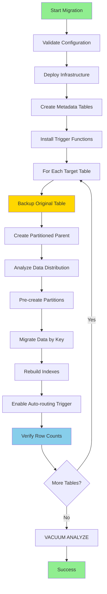
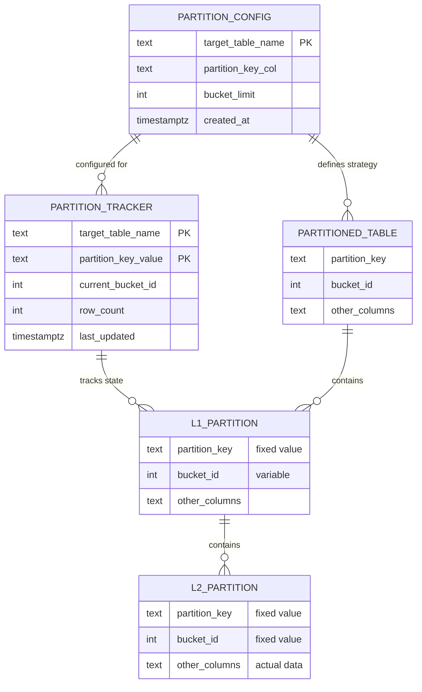
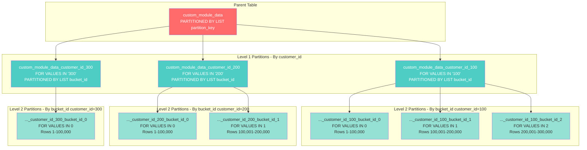
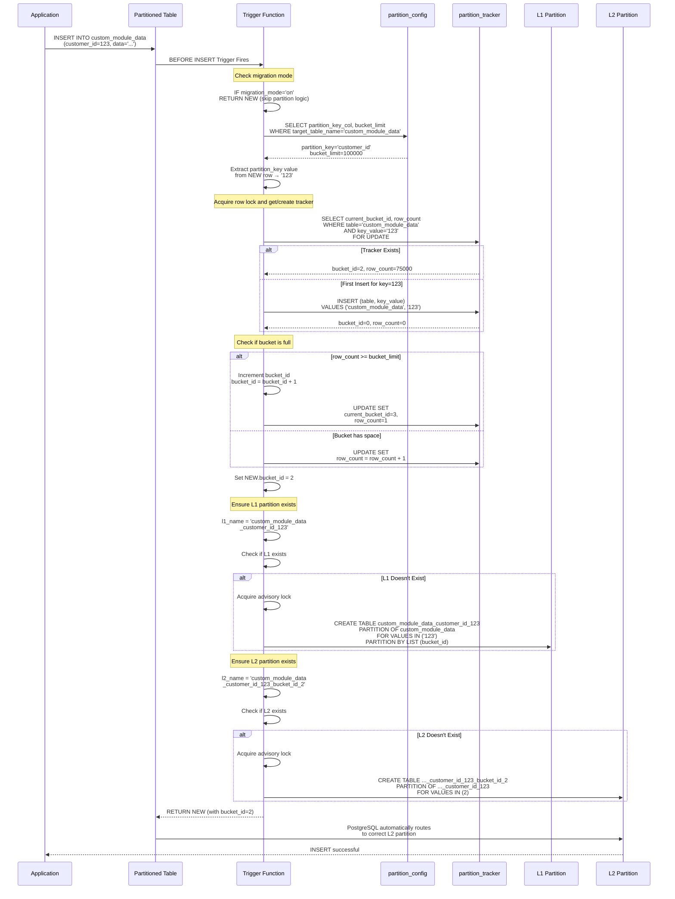
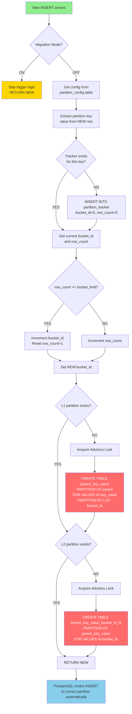
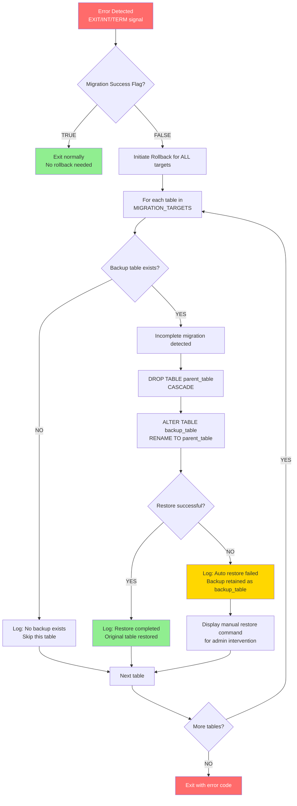
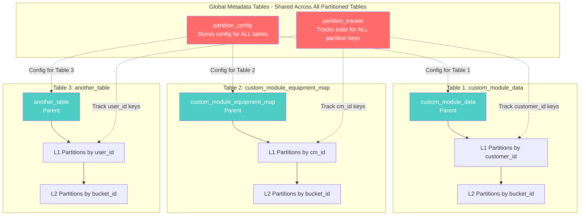

# PostgreSQL Table Partitioning Automation Script

## Overview

`data_partation.sh` is a comprehensive bash automation script designed to migrate PostgreSQL tables from standard structure to a **2-level LIST partitioning** scheme. It implements an intelligent partitioning strategy with automatic bucket management, data migration, and built-in rollback capabilities.

## Table of Contents

- [How It Works](#how-it-works)
- [Architecture](#architecture)
- [Features](#features)
- [Prerequisites](#prerequisites)
- [Configuration](#configuration)
- [Usage](#usage)
- [Partitioning Strategy](#partitioning-strategy)
- [Migration Process](#migration-process)
- [Rollback Mechanism](#rollback-mechanism)
- [Verification](#verification)
- [Troubleshooting](#troubleshooting)

---

## How It Works

The script automates the transformation of regular PostgreSQL tables into partitioned tables using a **2-level hierarchical partitioning strategy**:

1. **Level 1**: Partitions by a specified key column (e.g., `customer_id`)
2. **Level 2**: Sub-partitions by `bucket_id` to limit partition size

This approach prevents partition bloat and maintains optimal query performance even with millions of rows per key value.

### Example

If you have a table `custom_module_data` with 500,000 rows for `customer_id = 123` and set `BUCKET_LIMIT = 100000`:

```
custom_module_data (parent)
  ├── custom_module_data_customer_id_123 (L1 partition)
  │   ├── custom_module_data_customer_id_123_bucket_id_0 (100,000 rows)
  │   ├── custom_module_data_customer_id_123_bucket_id_1 (100,000 rows)
  │   ├── custom_module_data_customer_id_123_bucket_id_2 (100,000 rows)
  │   ├── custom_module_data_customer_id_123_bucket_id_3 (100,000 rows)
  │   └── custom_module_data_customer_id_123_bucket_id_4 (100,000 rows)
  └── custom_module_data_customer_id_456 (L1 partition)
      └── custom_module_data_customer_id_456_bucket_id_0 (50,000 rows)
```

---

## Architecture



### Infrastructure Components

The script creates the following PostgreSQL objects:

| Object | Type | Purpose |
|--------|------|---------|
| `partition_config` | Table | Stores partitioning configuration per table |
| `partition_tracker` | Table | Tracks current bucket and row count per partition key |
| `func_custom_partition_manager()` | Function | Trigger function for automatic partition routing |
| `proc_provision_batches()` | Procedure | Pre-creates partition hierarchy |
| `trg_partition_manager` | Trigger | Automatically routes new inserts to correct partition |

---

## Detailed System Architecture

### Metadata Tables Relationships



### Partition Hierarchy Structure



### Trigger Function Flow - INSERT Operation



### Automatic Partition Creation Flow



### Data Flow During Migration

```mermaid
graph LR
    subgraph "Before Migration"
        A1[custom_module_data<br/>Regular Table<br/>1,000,000 rows]
    end
    
    subgraph "Step 1: Backup"
        B1[custom_module_data_backup<br/>Original table renamed<br/>1,000,000 rows]
    end
    
    subgraph "Step 2: Create Parent"
        C1[custom_module_data<br/>PARTITIONED TABLE<br/>0 rows initially]
    end
    
    subgraph "Step 3: Analyze & Pre-create"
        D1[proc_provision_batches]
        D2[Analyze data distribution]
        D3[Calculate buckets needed]
        D4[Create L1 partitions]
        D5[Create L2 partitions]
    end
    
    subgraph "Step 4: Data Migration"
        E1[For each customer_id<br/>ordered by row count DESC]
        E2[INSERT with bucket_id calculation<br/>FLOOR row_number / bucket_limit]
        E3[Data copied to L2 partitions]
    end
    
    subgraph "Step 5: Enable Auto-routing"
        F1[CREATE TRIGGER<br/>trg_partition_manager]
        F2[Future INSERTs automatically<br/>routed to correct partition]
    end
    
    subgraph "Final State"
        G1[custom_module_data<br/>Parent Table]
        G2[L1: customer_id partitions]
        G3[L2: bucket_id partitions<br/>1,000,000 rows total]
        G4[custom_module_data_backup<br/>Kept for safety]
    end
    
    A1 -->|RENAME TO| B1
    B1 --> C1
    C1 --> D1
    D1 --> D2 --> D3 --> D4 --> D5
    D5 --> E1
    B1 -.->|Read data| E1
    E1 --> E2 --> E3
    E3 --> F1 --> F2
    F2 --> G1
    G1 --> G2 --> G3
    B1 -.->|Preserved| G4
    
    style A1 fill:#FFE5E5
    style B1 fill:#FFD700
    style C1 fill:#E5F5FF
    style G3 fill:#90EE90
    style G4 fill:#FFD700
```



### Rollback Mechanism Flow



### Multi-Table Coordination

When migrating multiple tables simultaneously:



#### Metadata Table Content Examples

**partition_config table**:
```sql
target_table_name              | partition_key_col | bucket_limit | created_at
-------------------------------|-------------------|--------------|-------------------------
custom_module_data             | customer_id       | 100000       | 2025-11-30 21:00:00
custom_module_equipment_map    | cm_id             | 100000       | 2025-11-30 21:05:00
another_table                  | user_id           | 50000        | 2025-11-30 21:10:00
```

**partition_tracker table**:
```sql
target_table_name           | partition_key_value | current_bucket_id | row_count | last_updated
----------------------------|---------------------|-------------------|-----------|-------------------------
custom_module_data          | 100                 | 2                 | 45000     | 2025-11-30 21:30:00
custom_module_data          | 200                 | 0                 | 5000      | 2025-11-30 21:29:00
custom_module_data          | 300                 | 5                 | 99999     | 2025-11-30 21:31:00
custom_module_equipment_map | 501                 | 1                 | 50000     | 2025-11-30 21:28:00
custom_module_equipment_map | 502                 | 0                 | 25000     | 2025-11-30 21:27:00
another_table               | user_123            | 0                 | 10000     | 2025-11-30 21:25:00
```

---

## Features

### ✅ Core Capabilities

- **Automated 2-level partitioning** (LIST by key → LIST by bucket_id)
- **Zero-downtime migration** with backup preservation
- **Intelligent bucket sizing** to prevent partition bloat
- **Automatic partition creation** for future inserts via triggers
- **Index replication** with auto-adjustment for partition constraints
- **Comprehensive rollback** on failure
- **Data integrity verification** with row count validation
- **Colored console output** for easy monitoring
- **Idempotent design** - safe to re-run after failures

### 🔐 Safety Features

- Preserves original table as `{table}_backup`
- Automatic rollback on failures (Ctrl+C, errors, crashes)
- Validates configuration before execution
- Transactional operations with proper error handling
- Row count verification after migration

---

## Prerequisites

### System Requirements

- **PostgreSQL**: 10 or higher (partitioning support required)
- **Bash**: 4.0+
- **psql**: PostgreSQL client tools
- **Permissions**: Database user with CREATE, ALTER, DROP, INSERT privileges

### Database Connection

The script requires access to a PostgreSQL database. Ensure you have:

1. Network access to the PostgreSQL server
2. Valid credentials with sufficient privileges
3. Database name and connection details

---

## Configuration

### Database Connection Settings

Edit the configuration section at the top of the script:

```bash
# --- CONFIGURATION ---
DB_HOST="localhost"       # PostgreSQL host
DB_PORT="5432"            # PostgreSQL port
DB_NAME="terotam_local"   # Database name
DB_USER="postgres"        # Database user
DB_PASS="0206"            # Database password

TARGET_SCHEMA="public"    # Schema containing tables
MAIN_LIMIT=100000         # Default bucket size (rows per partition)
```

> **Security Note**: For production, export `DB_PASS` as an environment variable instead of hardcoding:
> ```bash
> export DB_PASS="your_password"
> ./data_partation.sh
> ```

### Table Migration Targets

Define tables to migrate in the `MIGRATION_TARGETS` array:

```bash
declare -a MIGRATION_TARGETS=(
    # Format: "table_name : partition_key_column : bucket_limit"
    "custom_module_data : customer_id : ${MAIN_LIMIT}"
    "custom_module_equipment_map : cm_id : ${MAIN_LIMIT}"
    
    # You can comment out tables to skip them:
    # "other_table : user_id : 50000"
)
```

**Configuration Format**:
- **Table Name**: Name of the table to partition
- **Partition Key**: Column to use for Level 1 partitioning
- **Bucket Limit**: Maximum rows per Level 2 partition

---

## Usage

### Basic Execution

```bash
# Make script executable
chmod +x data_partation.sh

# Run the migration
./data_partation.sh
```

### Using Environment Variables

```bash
# Override database credentials
export DB_HOST="production-db.example.com"
export DB_PORT="5432"
export DB_NAME="production_db"
export DB_USER="migration_user"
export DB_PASS="secure_password"

./data_partation.sh
```

### Dry Run (Recommended First Step)

To understand what will happen without making changes:

1. Comment out all tables in `MIGRATION_TARGETS` except one test table
2. Use a small `BUCKET_LIMIT` value
3. Run on a development/staging database first
4. Review the backup table after migration

---

## Partitioning Strategy

### 2-Level LIST Partitioning

The script implements a hierarchical partitioning strategy:

#### Level 1: Partition by Key Column
Each unique value of the partition key gets its own partition.

```sql
CREATE TABLE custom_module_data_customer_id_123 
  PARTITION OF custom_module_data 
  FOR VALUES IN ('123') 
  PARTITION BY LIST (bucket_id);
```

#### Level 2: Partition by Bucket ID
Each Level 1 partition is further divided into buckets based on row count.

```sql
CREATE TABLE custom_module_data_customer_id_123_bucket_id_0 
  PARTITION OF custom_module_data_customer_id_123 
  FOR VALUES IN (0);
```

### Bucket Calculation

For each partition key value, buckets are created as:

```
bucket_id = FLOOR((row_number - 1) / BUCKET_LIMIT)
```

**Example**: With `BUCKET_LIMIT = 100000`:
- Rows 1-100,000 → `bucket_id = 0`
- Rows 100,001-200,000 → `bucket_id = 1`
- Rows 200,001-300,000 → `bucket_id = 2`

---

## Migration Process

### Phase 1: Infrastructure Deployment

The script creates necessary infrastructure:

1. **Metadata Tables**:
   - `partition_config`: Stores configuration per table
   - `partition_tracker`: Tracks bucket state for each partition key

2. **Trigger Function**: `func_custom_partition_manager()`
   - Automatically calculates correct bucket_id
   - Creates partitions on-the-fly if missing
   - Updates partition tracker metadata

3. **Provisioning Procedure**: `proc_provision_batches()`
   - Analyzes data distribution
   - Pre-creates partition hierarchy
   - Optimizes for bulk operations

### Phase 2: Table Migration

For each table in `MIGRATION_TARGETS`:

#### Step 1: Backup Original Table
```sql
ALTER TABLE custom_module_data RENAME TO custom_module_data_backup;
```

#### Step 2: Create Partitioned Parent
```sql
CREATE TABLE custom_module_data (
    -- All original columns
    bucket_id INT NOT NULL DEFAULT 0,
    PRIMARY KEY (original_pk_columns, bucket_id)
) PARTITION BY LIST (partition_key_column);
```

#### Step 3: Pre-create Partition Hierarchy
Analyzes backup table and creates all required L1 and L2 partitions.

#### Step 4: Migrate Data
```sql
-- For each partition key value (largest first)
INSERT INTO custom_module_data (columns, bucket_id)
SELECT columns, FLOOR((ROW_NUMBER() OVER (ORDER BY (SELECT NULL)) - 1) / bucket_limit)
FROM custom_module_data_backup
WHERE partition_key = 'value';
```

#### Step 5: Enable Auto-routing Trigger
```sql
CREATE TRIGGER trg_partition_manager 
  BEFORE INSERT ON custom_module_data
  FOR EACH ROW 
  EXECUTE FUNCTION func_custom_partition_manager();
```

#### Step 6: Verify Data Integrity
Compares row counts between backup and partitioned tables.

---

## Rollback Mechanism

### Automatic Rollback

The script includes comprehensive error handling that automatically rolls back on:

- Script errors (syntax, runtime)
- Database connection failures
- User interruption (Ctrl+C)
- System signals (SIGTERM, SIGINT)

### Rollback Process

When a failure is detected:

1. **Detection**: Trap catches EXIT, INT, or TERM signals
2. **Evaluation**: Checks if migration completed successfully
3. **Restoration**: For each table with a backup:
   ```bash
   DROP TABLE IF EXISTS table_name CASCADE;
   ALTER TABLE table_name_backup RENAME TO table_name;
   ```
4. **Verification**: Confirms restoration success

### Manual Rollback

If automatic rollback fails, restore manually:

```sql
-- Drop the partially migrated table
DROP TABLE IF EXISTS custom_module_data CASCADE;

-- Restore from backup
ALTER TABLE custom_module_data_backup RENAME TO custom_module_data;
```

---

## Verification

### Automated Verification

The script performs automatic verification:

1. **Row Count Validation**:
   ```sql
   SELECT count(*) FROM original_table;
   SELECT count(*) FROM partitioned_table;
   ```

2. **Partition Structure**:
   ```sql
   SELECT 
       schemaname, tablename, 
       pg_size_pretty(pg_total_relation_size(schemaname||'.'||tablename)) 
   FROM pg_tables 
   WHERE tablename LIKE 'custom_module_data%'
   ORDER BY tablename;
   ```

### Manual Verification Steps

After migration, verify data integrity:

```sql
-- 1. Check partition structure
SELECT 
    parent.relname AS parent_table,
    child.relname AS partition_name,
    pg_get_expr(child.relpartbound, child.oid) AS partition_bound
FROM pg_inherits
JOIN pg_class parent ON pg_inherits.inhparent = parent.oid
JOIN pg_class child ON pg_inherits.inhrelid = child.oid
WHERE parent.relname = 'custom_module_data'
ORDER BY child.relname;

-- 2. Verify data distribution
SELECT 
    tableoid::regclass AS partition,
    count(*) AS row_count
FROM custom_module_data
GROUP BY tableoid
ORDER BY partition;

-- 3. Test insert (should auto-route to correct partition)
INSERT INTO custom_module_data (customer_id, other_columns) 
VALUES (999, ...);

-- 4. Verify the insert went to correct partition
SELECT tableoid::regclass, * 
FROM custom_module_data 
WHERE customer_id = 999;
```

---

## Troubleshooting

### Common Issues

#### 1. Connection Refused

**Error**: `Cannot connect to PostgreSQL`

**Solution**:
- Verify `DB_HOST`, `DB_PORT`, `DB_NAME` are correct
- Check PostgreSQL is running: `sudo systemctl status postgresql`
- Verify firewall rules allow connection
- Test connection: `psql -h $DB_HOST -p $DB_PORT -U $DB_USER -d $DB_NAME`

#### 2. Permission Denied

**Error**: `ERROR: permission denied for schema public`

**Solution**:
- Ensure user has required privileges:
  ```sql
  GRANT CREATE, USAGE ON SCHEMA public TO your_user;
  GRANT ALL PRIVILEGES ON ALL TABLES IN SCHEMA public TO your_user;
  ```

#### 3. Partition Key Cannot Be NULL

**Error**: `Partition Key cannot be NULL`

**Solution**:
- Ensure partition key column has `NOT NULL` constraint
- Clean data before migration:
  ```sql
  UPDATE table_name SET partition_key = 'default_value' 
  WHERE partition_key IS NULL;
  ```

#### 4. Row Count Mismatch

**Warning**: `Row count mismatch detected!`

**Solution**:
- Check for failed partition migrations in logs
- Verify no concurrent writes occurred during migration
- Manually compare data:
  ```sql
  SELECT * FROM original_backup 
  EXCEPT 
  SELECT column1, column2, ... FROM partitioned_table;
  ```

#### 5. Unique Index Conflicts

**Warning**: `must include all partitioning columns`

**Solution**:
- Script automatically converts conflicting UNIQUE indexes to regular indexes
- For critical UNIQUE constraints, include partition key in the index manually after migration

### Debugging

Enable verbose output:

```bash
# Add to script after shebang
set -x  # Print each command before execution
```

Check PostgreSQL logs:

```bash
# Find PostgreSQL log location
sudo -u postgres psql -c "SHOW log_directory;"
sudo -u postgres psql -c "SHOW log_filename;"

# View logs
tail -f /var/log/postgresql/postgresql-XX-main.log
```

---

## Performance Considerations

### Optimal Bucket Sizing

Choose `BUCKET_LIMIT` based on your use case:

| Use Case | Recommended Bucket Size | Rationale |
|----------|------------------------|-----------|
| High insert rate | 50,000 - 100,000 | Smaller buckets reduce contention |
| Read-heavy workloads | 100,000 - 500,000 | Larger buckets reduce partition count |
| Mixed workload | 100,000 | Balanced approach |
| Very large datasets | 200,000 - 500,000 | Fewer partitions to manage |

### Migration Time Estimates

Approximate migration time (depends on hardware):

- **100K rows**: 1-2 minutes
- **1M rows**: 5-10 minutes
- **10M rows**: 30-60 minutes
- **100M rows**: 3-5 hours

**Optimization Tips**:
- Run during low-traffic periods
- Increase `work_mem` temporarily: `SET work_mem = '256MB';`
- Disable autovacuum during migration
- Consider parallel migration of different tables

---

## Post-Migration Tasks

### 1. Remove Backup Tables (After Verification)

```sql
-- Only after thorough verification!
DROP TABLE custom_module_data_backup;
```

### 2. Update Application Code

Ensure your application:
- Includes `bucket_id` in PRIMARY KEY operations
- Handles composite primary keys correctly
- Updates any queries that reference table structure

### 3. Monitor Performance

```sql
-- Monitor partition sizes
SELECT 
    schemaname,
    tablename,
    pg_size_pretty(pg_total_relation_size(schemaname||'.'||tablename)) AS size
FROM pg_tables
WHERE tablename LIKE 'custom_module_data%'
ORDER BY pg_total_relation_size(schemaname||'.'||tablename) DESC;

-- Check partition pruning is working
EXPLAIN (ANALYZE, BUFFERS) 
SELECT * FROM custom_module_data WHERE customer_id = '123';
```

### 4. Schedule Maintenance

```sql
-- Regular ANALYZE for query planner
ANALYZE custom_module_data;

-- Periodic VACUUM for space reclamation
VACUUM ANALYZE custom_module_data;
```

---

## Advanced Configuration

### Custom Partition Key Expressions

For complex partitioning needs, modify the trigger function to support expressions:

```sql
-- Example: Partition by year from timestamp
v_key_val := EXTRACT(YEAR FROM (to_jsonb(NEW) ->> v_conf.partition_key_col)::timestamp);
```

### Multi-Tenant Optimization

For multi-tenant applications, use tenant ID as partition key:

```bash
MIGRATION_TARGETS=(
    "transactions : tenant_id : 100000"
    "users : organization_id : 50000"
)
```

Benefits:
- Tenant isolation at storage level
- Easy tenant deletion (drop partition)
- Improved query performance with partition pruning
